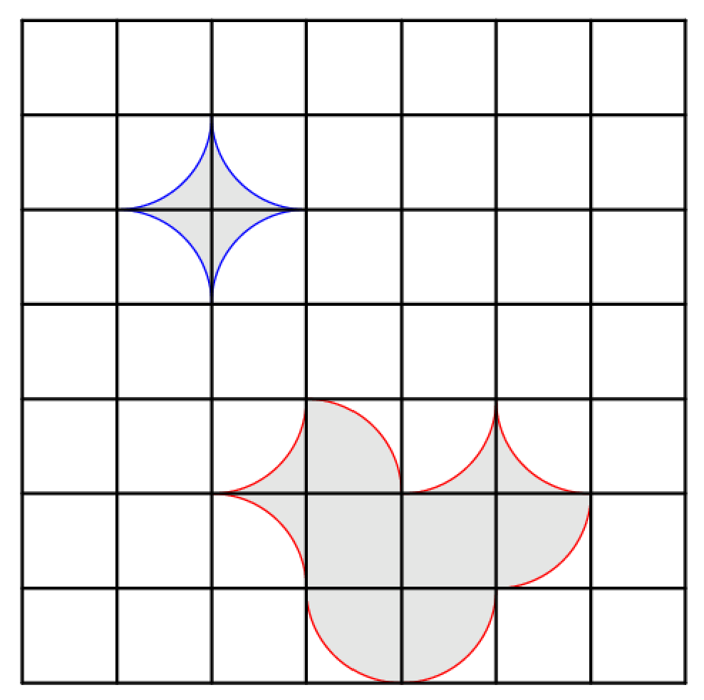

# Arc-edge Acreage - April 2023

**Category:** Geometry / Combinatorics
**URL:** https://www.janestreet.com/puzzles/arc-edge-acreage-index/

## Problem Statement

In the 7-by-7 grid, one can draw a simple closed curve using nothing but quarter-circle segments.

Two examples are shown:
- One enclosing a region of 4-π (in blue)
- One enclosing a region of area 6 (in red)

Note: A simple curve is not allowed to self-intersect.

It can be shown that there are 36 ways to enclose a region of area exactly 4-π.

**Question:** How many ways can one draw a curve enclosing a region of area exactly **32**?

**Image:**

