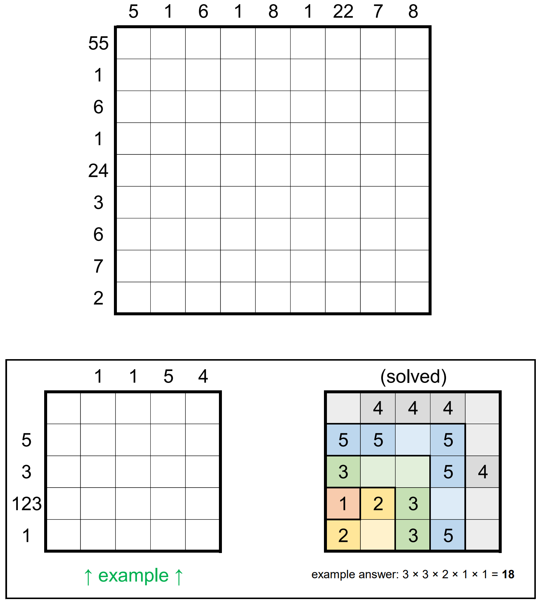

# Hooks 9 - June 2023

**Category:** Grid Puzzle
**URL:** https://www.janestreet.com/puzzles/hooks-9-index/

## Problem Statement

The grid can be partitioned into 9 L-shaped "hooks". The largest is 9-by-9 (contains 17 squares), the next largest is 8-by-8 (contains 15 squares), and so on. The smallest hook is just a single square.

Find where the hooks are located, and place nine 9's in one of the hooks, eight 8's in another, seven 7's in another, and so on.

### Rules

- The filled squares must form a connected region (squares are "connected" if they are orthogonally adjacent)
- Every 2-by-2 region must contain at least one unfilled square
- The numbers outside the grid denote the greatest common divisors (GCDs) of the numbers formed by concatenating digits in consecutive squares when reading left-to-right (within rows) or top-to-bottom (within columns)

**Answer:** The product of the areas of the connected groups of empty squares in the completed grid.

**Image:**

