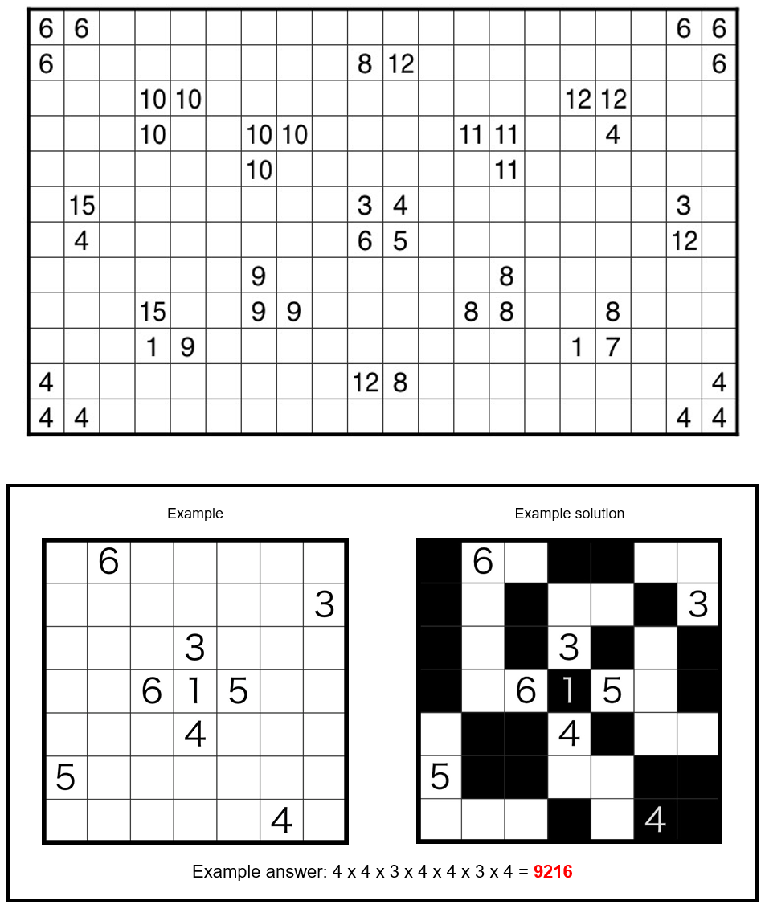

# Choco Banana - July 2023

**Category:** Grid Puzzle
**URL:** https://www.janestreet.com/puzzles/choco-banana-index/

## Problem Statement

Shade a subset of the cells in the grid to partition the cells into orthogonally connected *regions* of shaded and unshaded cells.

### Rules

- All regions of shaded cells are rectangular
- All regions of unshaded cells are **not** rectangular
- All number clues in the grid give the size of the region (shaded or unshaded) that the clue is in

**Answer:** The product of the number of unshaded cells in each row.

**Image:**

