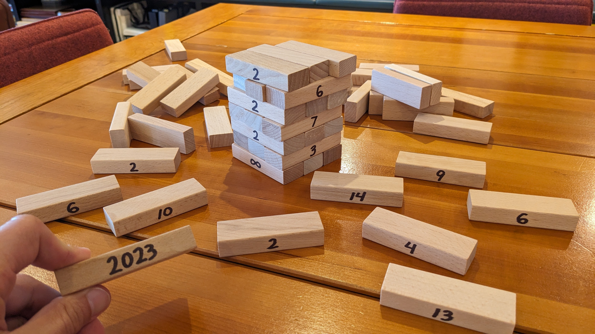

# Getting from a to b - September 2023

**Category:** Number Theory / Visual
**URL:** https://www.janestreet.com/puzzles/getting-from-a-to-b-index/

## Problem Statement

We're making a tower!

Initially, nobody thought out the huge energy needed. Even quite useful approaches looked suspect, adding tons of thought heretofore even beginning.

There have been some negatives along the way, but also some positives. But we've powered through it, one way or another, and things are looking up.

As you can see, rows 1 through 7 have already been built. (And we've got the next 9 figured out as well.)

However… I found this one piece near the bottom of the bag, I'm having trouble figuring out where it will go.

**Question:** Can you determine the first (lowest) row where it would make sense to place it?

**Image:**

