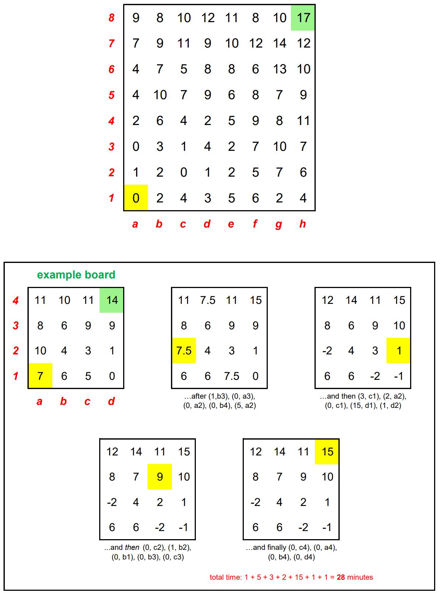

# Knight Moves 5 - November 2023

**Category:** Grid Puzzle / Optimization
**URL:** https://www.janestreet.com/puzzles/knight-moves-5-index/

## Problem Statement

An 8-by-8 "lattice" represents a **3-dimensional landscape**; the numbers at each "point" represent their **altitudes**.

A knight arrives at *a1* at time *T*=0, and wishes to travel to *h8*.

### The Twist: Sinking and Rising

The lattice was built on a swamp:
- When the knight arrives on a lattice point of altitude *A*, that point and *all others with the same altitude* start sinking at the rate of 1 unit per *n* minutes, where *n* is the number of lattice points of altitude *A*
- The lattice point **diametrically opposite** the one the knight is on **rises** at the rate of 1 unit per *n* minutes
- This sinking/rising continues only while the knight remains stationary
- Altitudes can become negative
- If the "opposite" point is at the same initial altitude, it neither rises nor sinks

### Movement Rules

The knight can only make 3-dimensional jumps that are permutations of (0, ±1, ±2). Jumps take 0 time.

### Goal

Find the path to *h8* that takes **as much time as possible**. Tours of **180 minutes or longer** are eligible for the leaderboard.

### Additional Rule

All "sinks" must be *necessary* sinks — there must be no way to replace the wait time without causing an illegal move.

**Answer format:** Comma-separated list of moves in notation (*t*, *P*) where *t* is minutes waited before jumping to point *P*.

**Image:**

