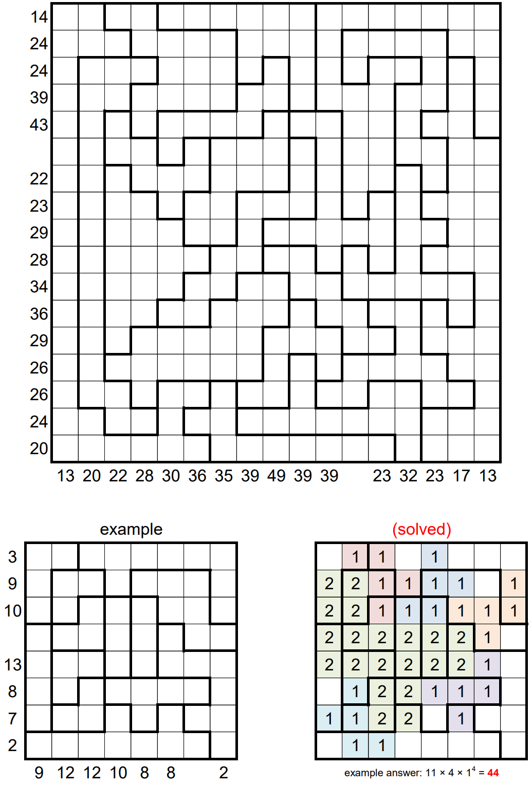

# Some F Squares - January 2024

**Category:** Grid Puzzle
**URL:** https://www.janestreet.com/puzzles/some-f-squares-index/

## Problem Statement

Place some non-overlapping "F"-shaped pentominos into the grid. Pentominos can be rotated, reflected, and enlarged.

### Rules

- Place a 1 inside each square in an unenlarged pentomino
- For a pentomino that has been enlarged by a factor of *N* > 1, place an *N* inside each square
- The sum of the numbered squares inside each outlined region must be the same
- A number outside the grid represents the sum of all numbered squares in the corresponding row or column of the completed grid

**Answer:** The product of the areas of the connected groups of orthogonally adjacent empty squares in the grid.

**Note:** This was Jane Street's 10th anniversary puzzle (their first puzzle was "Sum of Squares").

**Image:**

