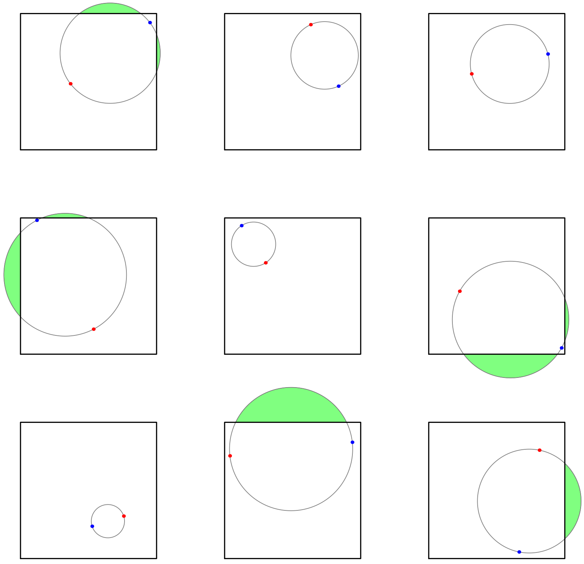

# Some Off Square - February 2024

**Category:** Geometry / Probability
**URL:** https://www.janestreet.com/puzzles/some-off-square-index/

## Problem Statement

A circle is randomly generated by sampling two points uniformly and independently from the interior of a square and using these points to determine its diameter.

What is the probability that the circle has a part of it that is off the square?

**Answer format:** Give your answer in exact terms.

**Image:**

