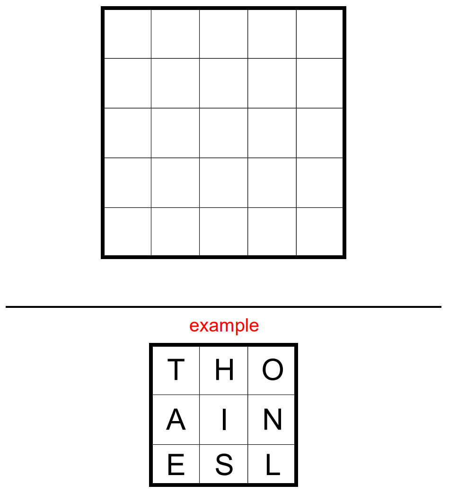

# Altered States 2 - June 2024

**Category:** Word Puzzle / Optimization
**URL:** https://www.janestreet.com/puzzles/altered-states-2-index/

## Problem Statement

Your goal is to score **as many points as possible** by placing **U.S. states** in a 5-by-5 grid.

### Rules

- States can be spelled by making **King's moves** from square to square
- The score for a state is its **population** in the 2020 U.S. Census (e.g., CALIFORNIA scores 39,538,223 points)
- You may "alter" the name of a state by *at most one letter*. "Altering" means replacing a letter with another letter. (So NEW**P**ORK, NEWYOR**F**, and NEWYORK would all score for NEWYORK, but NEWYRK and NEWY**RO**K would not.)
- If a state appears multiple times in your grid, it only scores once

### Submission Format

Render your grid as **one unbroken 25-digit string** by concatenating the rows.

### Leaderboard Requirement

Your entry must score **at least half** of the available points (at least 165,379,868).

### Special Awards

- **20S**: visits at least 20 states
- **200M**: scores at least 200 million
- **PA**: visits Pennsylvania
- **M8**: contains all 8 states that begin with an M
- **4C**: contains the "Four Corners" states
- **NOCAL**: avoids California
- **C2C**: contains a coast-to-coast chain (East coast to West coast, states must have positive joint border length)

**Image:**

