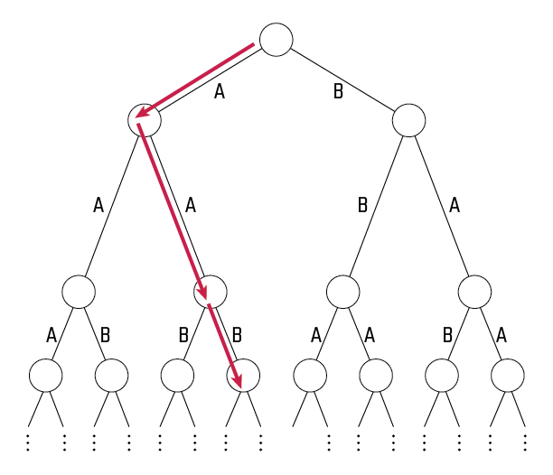

# Tree-edge Triage - August 2024

**Category:** Graph Theory / Probability
**URL:** https://www.janestreet.com/puzzles/tree-edge-triage-index/

## Problem Statement

Aaron and Beren are playing a game on an infinite complete binary tree. At the beginning of the game, every edge of the tree is independently labeled *A* with probability *p* and *B* otherwise. Both players are able to inspect all of these labels.

Then, starting with Aaron at the root of the tree, the players alternate turns moving a shared token down the tree (each turn the active player selects from the two descendants of the current node and moves the token along the edge to that node).

**Winning Conditions:**
- If the token ever traverses an edge labeled *B*, Beren wins the game
- Otherwise, Aaron wins

**Precision note:** After the edges are labeled and inspected, Beren is allowed to name any positive integer *N*. Aaron wins if the first *N* edges traversed by the token are all labeled *A*, Beren wins if any of them are labeled *B*.

**Question:** What is the infimum of the set of all probabilities *p* for which Aaron has a nonzero probability of winning the game?

**Answer format:** Exact terms

**Image:**

