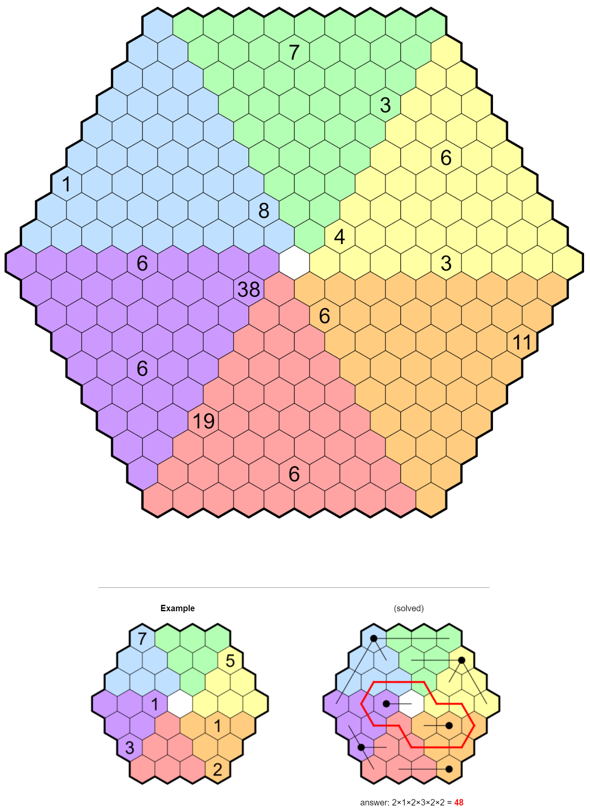

# Fences 2 - September 2024

**Category:** Grid Puzzle
**URL:** https://www.janestreet.com/puzzles/fences-2-index/

## Problem Statement

A field is divided into hexagonal cells of width 1. Some of the cells contain "posts" at their center. Each post is represented in the field (grid) by a number.

### Rules

Construct one or more fences emanating from each post, such that the total length of fence connected to a post equals the number given.

- Fences are straight line segments with integer length
- Fences can only intersect cell walls at right angles
- Fences from different posts may not touch
- A fence from one post may not touch a different post

### Goal

Build your fences in such a manner that it is possible to draw a **closed loop** through some of the **remaining empty cells**.

- The loop may only make 120-degree turns
- It must visit each of the six colored regions
- The loop must be **symmetric** in some way (either via rotation or reflection)
- The loop must be rectilinear, passing through the centers of adjacent empty cells

**Answer:** Once you have completed the loop, determine the number of cells it visits in each of the six colored regions. The answer is the **product** of these six values.

**Image:**

