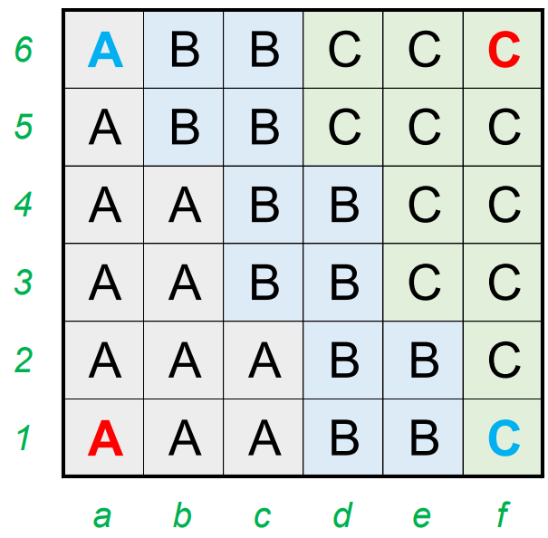

# Knight Moves 6 - October 2024

**Category:** Grid Puzzle
**URL:** https://www.janestreet.com/puzzles/knight-moves-6-index/

## Problem Statement

Pick **distinct positive integers** *A*, *B*, and *C*, and place them in the grid. Your goal is to create two corner-to-corner trips — one from *a1* to *f6*, and the other from *a6* to *f1* — both of which score **exactly 2024 points**.

### Rules

A "trip" consists of knight's moves. Squares may **not** be revisited within a trip.

The "score" for a trip is calculated as follows:
- Start with *A* points
- Every time you make a move:
  - If your move is between two *different* integers, **multiply** your score by the value you are moving to
  - Otherwise, **increment** your score by the value you are moving to

### Challenge

Find positive integers *A*, *B*, and *C*, as well as a pair of trips, that satisfy the criteria above. How low can you get *A* + *B* + *C*?

**Answer format:** Concatenate your values for *A*, *B*, and *C*, followed by your *a1*-to-*f6* tour, followed by your *a6*-to-*f1* tour.

Example: "1,2,253,a1,b3,c5,d3,f4,d5,f6,a6,c5,a4,b2,c4,d2,f1"

**Leaderboard requirement:** *A* + *B* + *C* must be less than 50.

**Image:**

