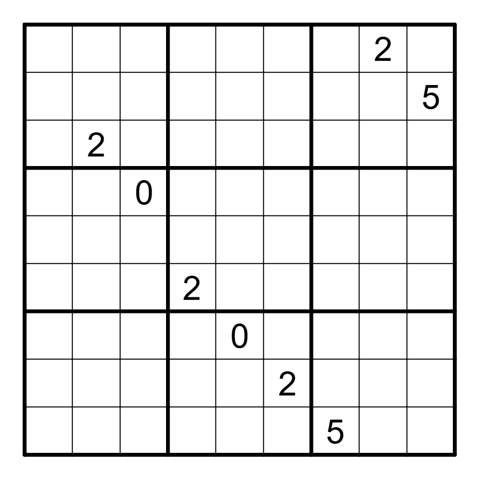

# Somewhat Square Sudoku - January 2025

**Category:** Sudoku Variant
**URL:** https://www.janestreet.com/puzzles/somewhat-square-sudoku-index/

## Problem Statement

Fill the empty cells in the grid with digits such that each row, column, and outlined 3-by-3 box contains the same set of nine unique digits (you'll be using nine of the ten digits 0-9).

The nine 9-digit numbers formed by the rows of the grid (possibly with a leading 0) must have the highest-possible GCD over *any* such grid.

Some of the cells have already been filled in.

**Answer:** The 9-digit number formed by the middle row in the completed grid.

**Image:**

