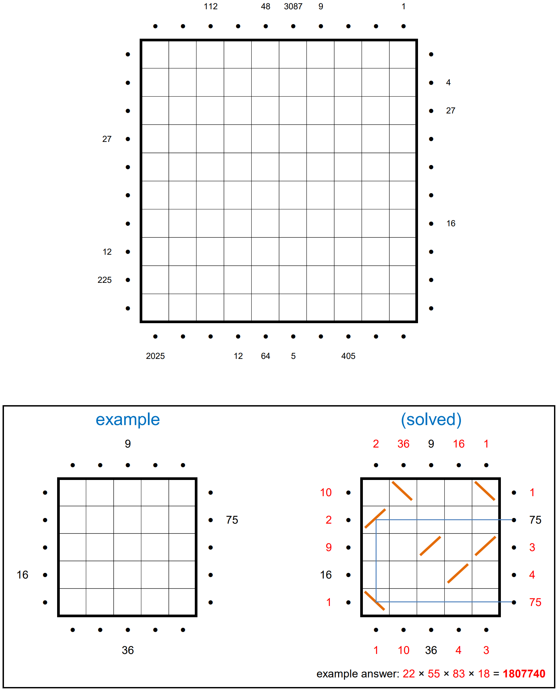

# Hall of Mirrors 3 - March 2025

**Category:** Grid Puzzle
**URL:** https://www.janestreet.com/puzzles/hall-of-mirrors-3-index/

## Problem Statement

The perimeter of a 10-by-10 square field is surrounded by lasers pointing into the field. (Each laser begins half a unit from the edge of the field, as indicated by the •'s.)

Some of the lasers have numbers beside them. Place diagonal mirrors in some of the cells so that the **product** of the **segment lengths** of a laser's path matches the clue numbers. (For instance, the segments for the "75" path in the example puzzle have lengths 5, 3, 5.)

Mirrors may not be placed in orthogonally adjacent cells.

Once finished, determine the missing clue numbers for the perimeter, and calculate the sum of these clues for each side of the square.

**Answer:** The product of these four sums.

**Image:**

