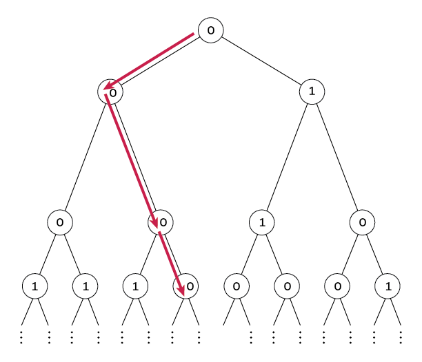

# Sum One, Somewhere - April 2025

**Category:** Probability
**URL:** https://www.janestreet.com/puzzles/sum-one-somewhere-index/

## Problem Statement

For a fixed *p*, independently label the nodes of an infinite complete binary tree 0 with probability *p*, and 1 otherwise.

For what *p* is there exactly a 1/2 probability that there exists an infinite path down the tree that sums to **at most 1** (that is, all nodes visited, with the possible exception of one, will be labeled 0)?

**Answer format:** Find this value of *p* accurate to 10 decimal places.

**Image:**

