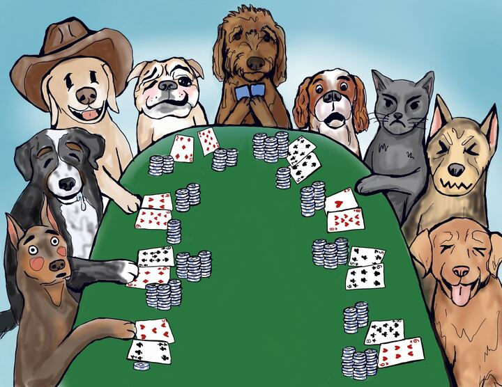

# Dogs Playing Poker - August 2025

**Category:** Visual Puzzle
**URL:** https://www.janestreet.com/puzzles/dogs-playing-poker-index/

## Problem Statement

You won't find poker faces here – these poor pups can't hide their emotions or the cards that cause them! What they're feeling is practically spelled out for everyone to see. It should be enough for you to figure out which cards my pet doodle is holding.

**Answer format:** Abbreviation of the cards using letters or numbers with the card then suit. For example, the Ace of Spades and Ten of Hearts would be abbreviated as **AS,10H**.

**Image:**

