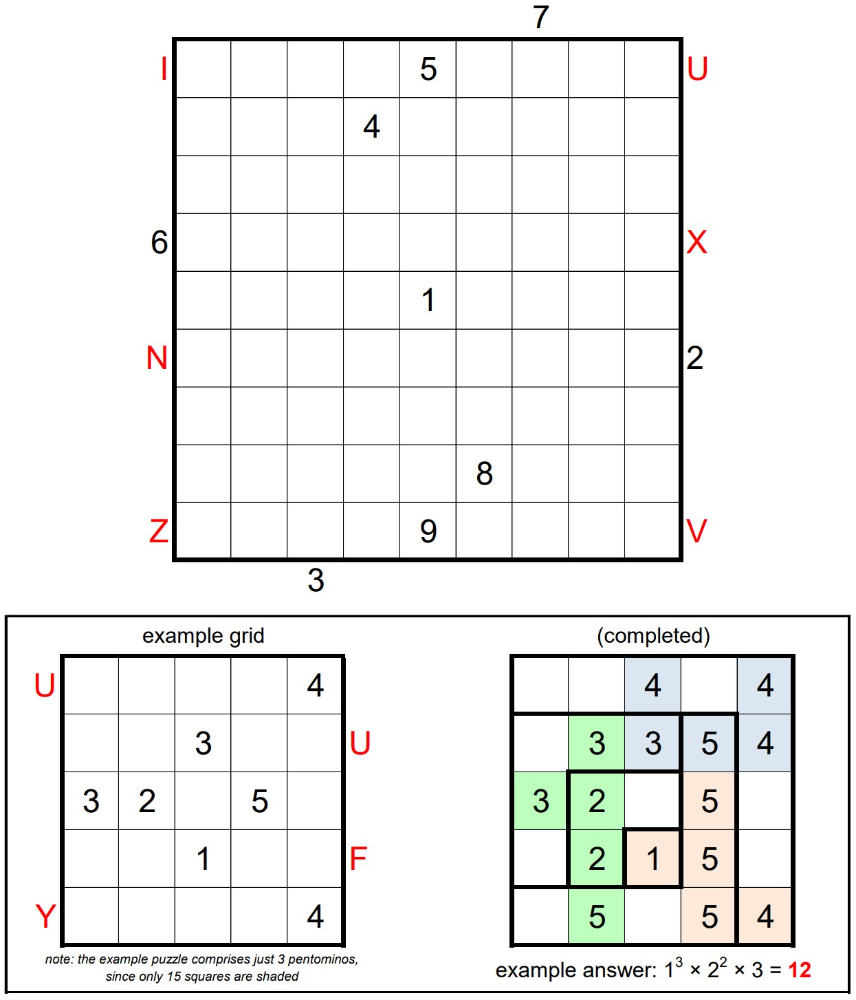

# Hooks 11 - September 2025

**Category:** Grid Puzzle
**URL:** https://www.janestreet.com/puzzles/hooks-11-index/

## Problem Statement

The grid can be partitioned into 9 L-shaped "hooks". The largest is 9-by-9 (contains 17 squares), the next largest is 8-by-8 (contains 15 squares), and so on. The smallest hook is just a single square. Find where the hooks are located, and place nine 9's in one of the hooks, eight 8's in another, seven 7's in another, and so on.

The filled squares must form a connected region. (Squares are "connected" if they are orthogonally adjacent.) Furthermore, every 2-by-2 region must contain at least one unfilled square.

The set of filled squares must be decomposable into **9 distinct pentominos**, with no repeated shapes (including reflection or rotation). Finally, the sum of the values in each pentomino must be a multiple of 5.

A value *outside* the grid denotes either the first number or pentomino (from the decomposition) seen when looking into that row or column.

**Pentomino naming:** Using the canonical pentomino naming scheme – F, I, L, N, P, T, U, V, W, X, Y, Z.

**Answer:** The product of the areas of the connected groups of empty squares in the completed grid.

**Image:**

