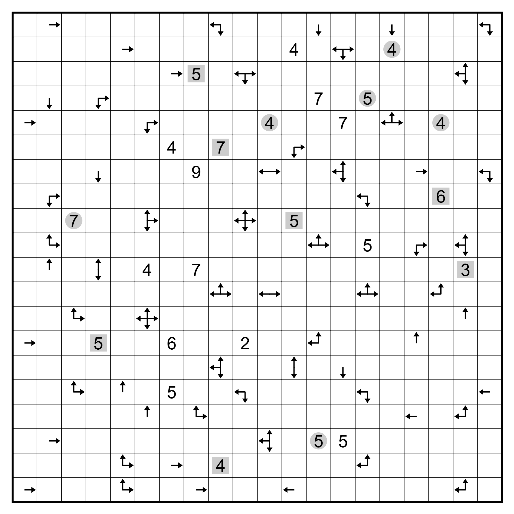

# Shut the Box - November 2025

**Category:** Grid Puzzle
**URL:** https://www.janestreet.com/puzzles/shut-the-box-index/

## Problem Statement

Use a scissors to cut away one or more groups of orthogonally connected cells (squares) from the grid above. Any group you cut away must have at least one cell along the boundary of the grid. The remaining cells must be orthogonally connected and not have any holes.

It must be possible to fold along some of the grid lines so that the remaining cells form the six walls of a rectangular solid (the "box"). There may not be any overlapping cells in the box.

Some cells have been labeled with **arrows**. These cells are _not_ part of the box, but instead point in the direction(s) of the nearest box cells (looking in that square's row and column).

Some cells have been labeled with **numbers**. These cells _are_ part of the box. A number indicates how many cells within one king's move of that cell are a part of the box. (Including the numbered cell.)

When the box is assembled, each _grey circle_ should be directly opposite another grey circle. Each _gray square_ should be orthogonally adjacent to (and on the same face as) another gray square.

Once you have assembled the box, compute, on each face, the sum of the numbered cells. The answer to this puzzle is the **product** of these six sums.

**Note:** "Opposite" means the line segment connecting the circles should be orthogonal to the faces containing them.

**Image:**

**Example:** An example grid can be seen at https://www.janestreet.com/static/pdfs/puzzles/nov-2025-box-example.pdf