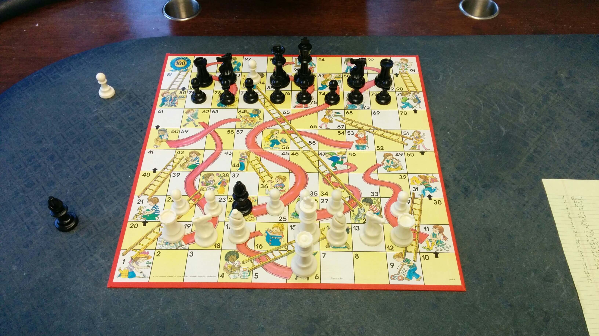
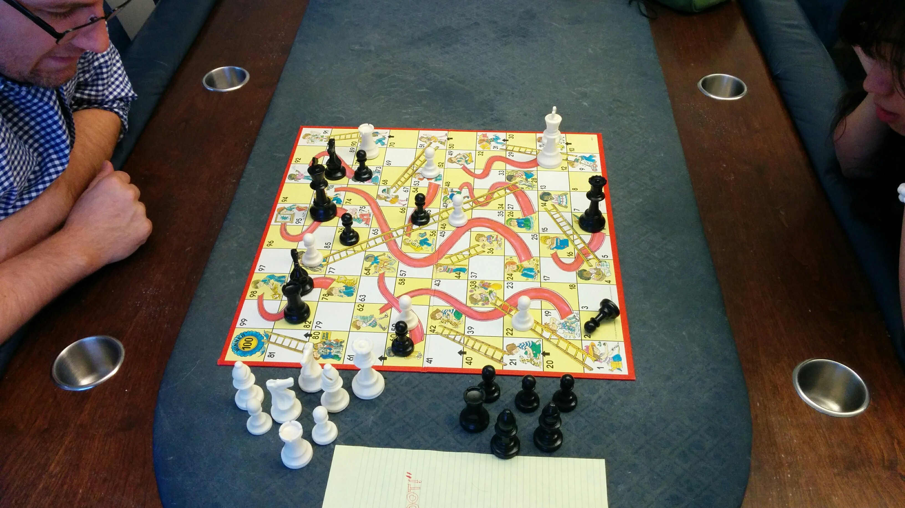
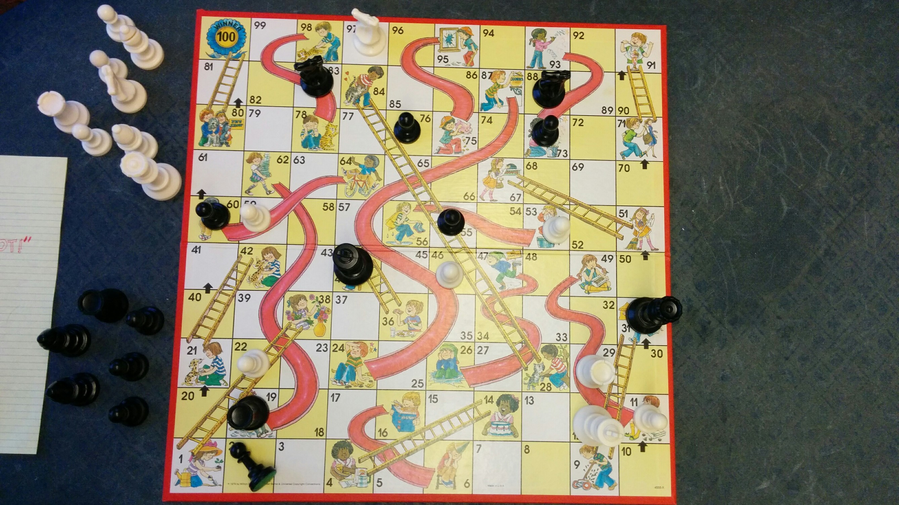

# Oh CHUTE! - February 2015 (Solution)

**Puzzle:** [02_oh_chute.md](../../puzzles/2015/02_oh_chute.md)

## Official Solution

As only a few astute solvers figured out, this puzzle involved playing chess, but on a Chutes and Ladders board rather than a regular chess board! The rows were numbered 0,1,…,9, and the columns lettered z,a,…,i.

Where the game leaves off, white is in check, and its only move is **Kc8** (via the ladder). (Kxi3, via Kh0, is another intriguing option, but it would still be in check by the queen on a0).

**Images:**
- 
- 
- 

