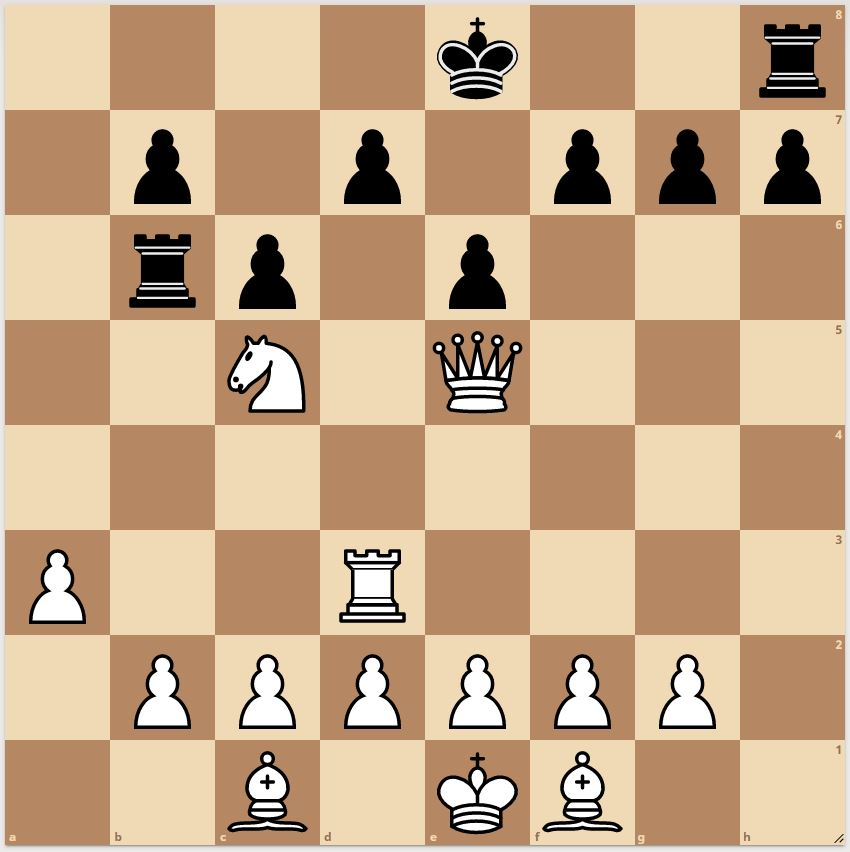

# Poetry in Motion - December 2019 (Solution)

**Puzzle:** [12_poetry_in_motion.md](../../puzzles/2019/12_poetry_in_motion.md)

## Official Solution

Each of the 8 lines of the poem contains 8 words. The poem represents a chessboard, where each word beginning with K, Q, R, B, N, or P represents a king, queen, rook, bishop, knight, or pawn.

Five lines are capitalized (white pieces) and three are not (black pieces), as in FEN notation.

The key insight is determining whether black can castle. Through retrograde analysis of the game history:
- White's queen must be a promoted h-pawn
- If promoted on c8, black must have already moved its king or rook

**Answer: Rxd7 followed by Qb8# (mate in 2)**

Black has already lost its option to castle.

**Solution image:**

